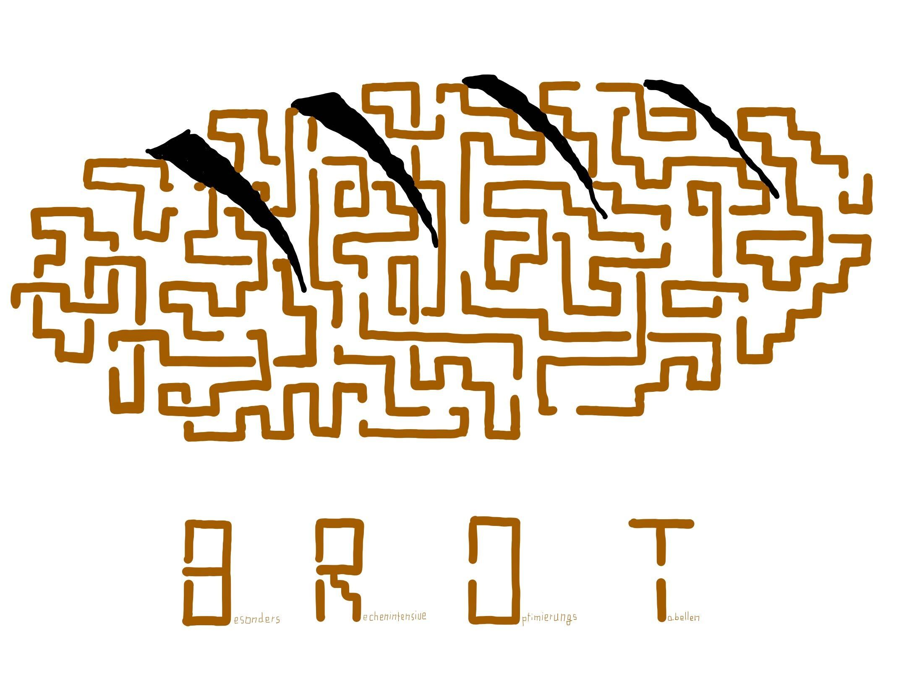

# brot

This repository contains a client for `spe_ed`, the game of the [InformatiCup 2021](https://github.com/InformatiCup/InformatiCup2021).

## Playing locally

To pull the server code, run `git submodule update --init`.

### Starting the server

To start the server, go into the `server` directory, build the code and run the server:

`cd server`

`go build` 

`./server`

### Starting the client

The clients' default server is the local server. To start a client, go into the `client` directory, build the code and run the client:

`cd client`

`go build`

`./client`

This runs the `combi` client. Other clients can be run with `./client -client <client>`.

The following clients are available:

- smart
- minimax
- rollouts
- probability
- combi

## Playing on the official server

To play on the official server, the environment variables `URL`, `TIME_URL` and `KEY` have to be set to the appropriate values:

`URL="wss://msoll.de/spe_ed" TIME_URL="https://msoll.de/spe_ed_time" KEY="<key>" ./client`

## Docker

To build the docker image, run `docker build . -t spe_ed`.

To run the client container, run `docker run -e URL="wss://msoll.de/spe_ed" -e TIME_URL="https://msoll.de/spe_ed_time" -e KEY="<key>" spe_ed`
