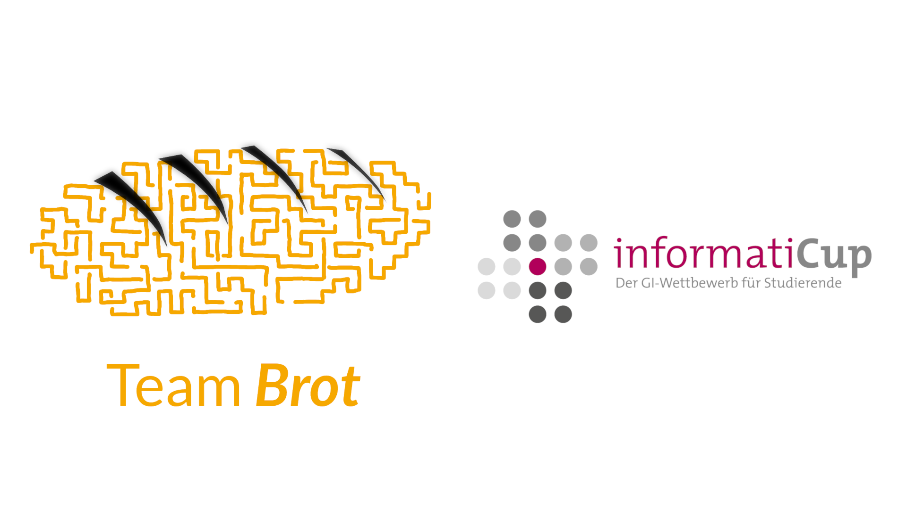

# Brot-Client

This repository contains our client for `spe_ed`, the game of the [InformatiCup 2021](https://github.com/InformatiCup/InformatiCup2021).

## Overview
In this README you find all the information you need to use our software. Navigate around with the table of contents. For more detailed information read the wiki or follow the links in the README. If you think something important is missing, feel free to open an .
- [Manual Installation](#installation)
- [Docker Installation](#docker)
- [Extensions](#extensions)

## Installation

### 0. Prerequisites

Our software is written in Go. So you need a up-to-date go installation. Information on how to install go on your computer you get . You need at least version 1.15.

This program uses the websocket library that can be found here: [https://github.com/gorilla/websocket](https://github.com/gorilla/websocket).

After installing go, you can run `go get github.com/gorilla/websocket` to install the library.

### 1. Cloning the repository

run `git clone https://github.com/TeamBrot/client.git` to clone the repository. 

run `cd client` to jump right into it.

### 2. Build

The client code is located in the `client` directory. Before building, go there by running `cd client`.

To build the code, run `go build`. If this step fails, check if you are in the right directory because the repository is also named client. If you change the code of the client and want the changes to take effect, you have to run the build command!

### 3. Setting up the development server

If you got your own `spe_ed` server you can skip this step. To run the client you need a server, that implements the game API. We wrote one for development purposes you can find . 

### 4. Running the Client

You can start the client by first going into the `client` directory and then running `./client`. If you get a connection established message you've succesfully setup our software 🥳

Now it tries to connect to our development server. If you wish to connect to an other server, set the `URL` environment variable accordingly. You find information about that [here](#connecting-to-other-servers)

This runs the `combi` client. Other clients can be run with `./client -client <client>`.

The following clients are available:

- `basic`
- `minimax`
- `rollouts`
- `probability`
- `combi`

## Connecting to other servers

To play on on other servers, the environment variables `URL`, `TIME_URL` and `KEY` have to be set to the appropriate values. 

For the official API of the competition, these are the values.

`URL="wss://msoll.de/spe_ed" TIME_URL="https://msoll.de/spe_ed_time" KEY="<key>"`

## Docker

To build the docker image, run `docker build . -t spe_ed`.

To run the client container, run `docker run -e URL="wss://msoll.de/spe_ed" -e TIME_URL="https://msoll.de/spe_ed_time" -e KEY="<key>" spe_ed`

## Extensions

### Testing against other clients

Run `./test_internal.sh` to start mutltiple games. This can be useful to test different parameters or to run statistical analytics.

Just change the script for your purposes.

### Testing on the official API

You can also run `./test_api.sh` to play multiple games without having to restart the client manually.

The default client is the `combi` client. You can change that by setting the variable `client` directly in the script.

